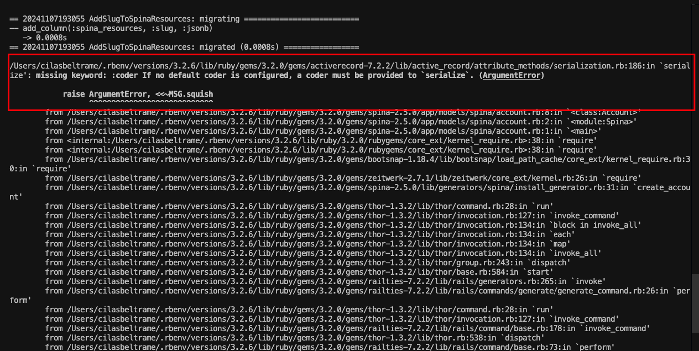
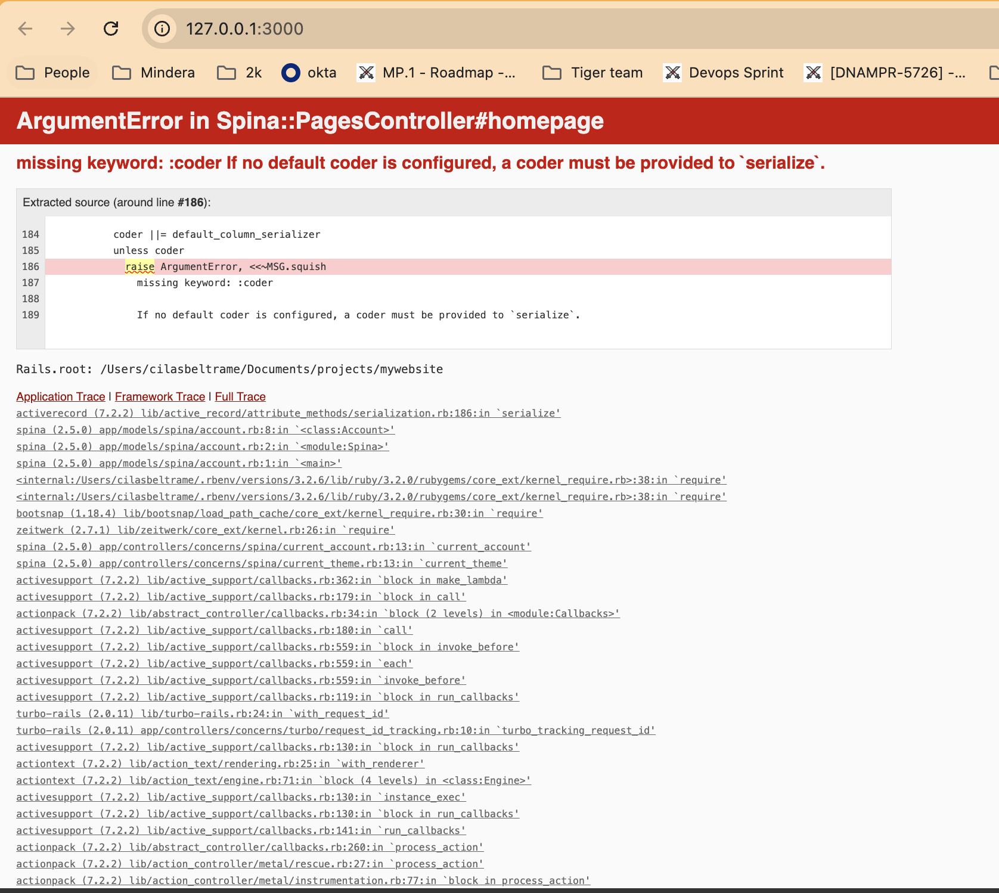
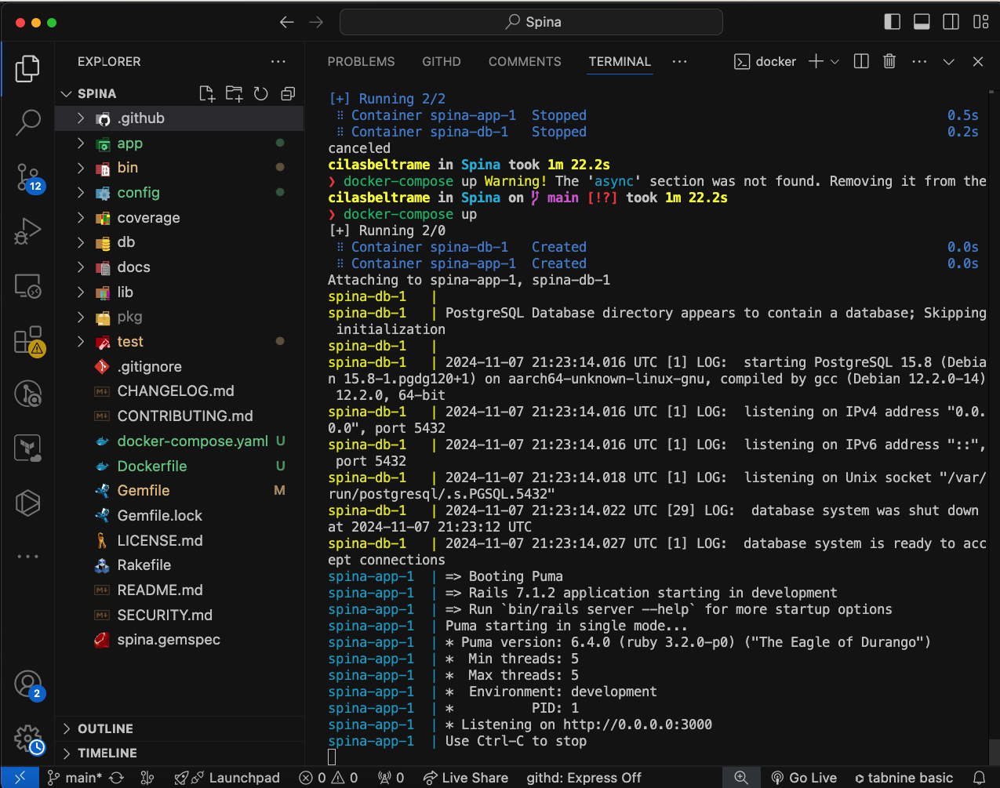
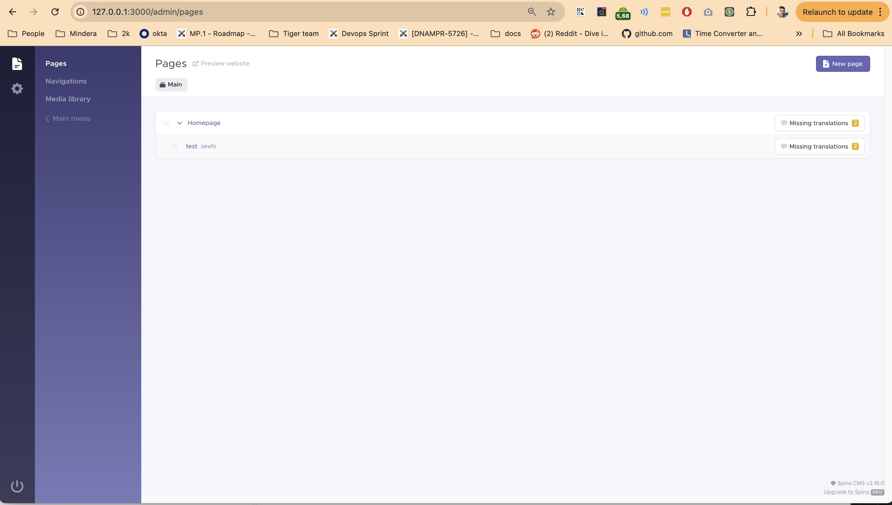

# My Blog
## Considerations
I had no prior experience building and managing Ruby dependencies, so this exercise provided a valuable learning opportunity.

## Setup

I have followed the following oficial links of Spina:
1. https://spinacms.com/guides/getting-started/how-to-get-started-with-spina-cms
2. https://spinacms.com/docs/getting-started/installing-spina

First of all, I have installed ruby in my local using the same Spina [guide](https://spinacms.com/docs/getting-started/installing-ruby) as well as postgresql. By doing this, in my opinion is much easier migrate a non docker app if you have familiarity how the build and the lib management works. At least I do that for the first deploy.

I have executed the exact command below in my local to create the skeleton and Spina bootstrap:
```
rails new yourwebsite --database=postgresql
rails db:create
rails active_storage:install
gem 'spina'
bundle install && rails g spina:install
rails s
```
Then I got the following error in `rails g spina:install` command:
 

I encountered a serialization error. After researching, I found a related [issue](https://github.com/public-activity/public_activity/issues/382) that suggested a possible bug in the library. Despite trying with Rails < 7.1, the issue persisted.

So, I gave a try an ran the app `rails s` and got the same error in the UI:


## Dockerize


As the skeleton app created comes with a dockerfile, I simply I adjusted the Dockerfile to run in development mode, allowing easier debugging and local testing.

I have left the rest as I could see a dockerfile running using:
1. Multi-stage mode for smaller images, another option is to use a single alpine image, light and clean too.
2.  Installing only the required libs.
3.  Running with a non root user for security purposes.

After that, I just built it locally and it went fine:

`docker build . -t mywebsite:latest`


As part of the exercise I have created `docker-compose.yaml` with the following command for the first time:

`command: sh -c "./bin/rails db:create && ./bin/rails g spina:install --silent && ./bin/rails s"`

The command creates the database, as well as is suppose to execute the CMS bootstrap with default configs:
```
    Your Spina site has been succesfully installed! 

    Restart your server and visit http://localhost:3000 in your browser!
    The admin backend is located at http://localhost:3000/admin.

    Site name      :  MySite
    Active theme   :  
    User email     :  admin@domain.com
    User password  :  password
```

## Final Considerations

1. Despite some initial challenges, I successfully set up Spina CMS in its own [repo](https://github.com/SpinaCMS/Spina) a Dockerized  app. Although the exercise required using Spina as a library.





2. Given my limited experience with Ruby applications, I occasionally encountered challenges with dependency management. For context, managing dependencies in a language I’m more familiar with, like Python, would have been much easier for me.
